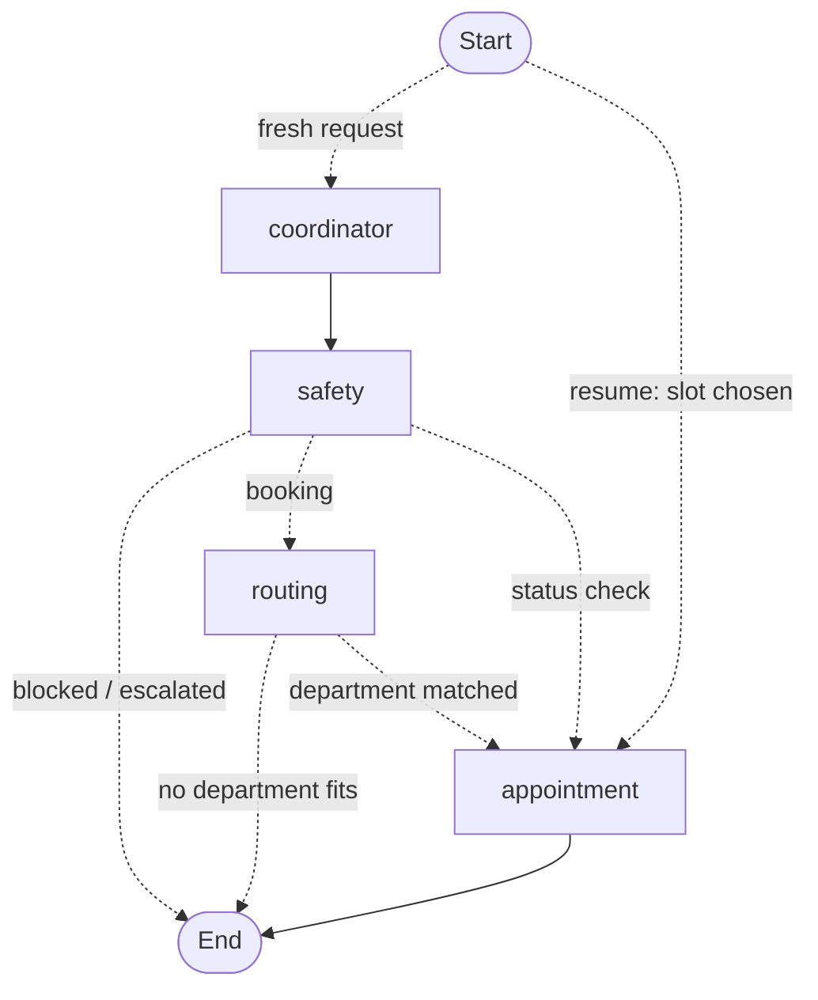

# AgentCare

AgentCare is an agentic AI application for hospital **administrative** workflows: identifying/registering patients, routing requests to the right department, checking doctor availability, booking/rescheduling/cancelling appointments, coordinating supporting documents, sending reminders, and escalating uncertain or sensitive cases to a human.

## What this is not

AgentCare does not diagnose conditions, prescribe medication, or recommend dosages, and it does not replace a healthcare professional. Its scope is strictly administrative. Any request that touches clinical judgment, or any emergency/uncertain situation, is escalated to a human rather than handled autonomously.

## Status

This project is under active development.

- [x] Relational schema on Supabase Postgres — departments, doctors, staff, patients, appointments, appointment slots, documents, workflow runs, reminders, escalations, audit log
- [x] Auth model — patients self-register; doctor/staff accounts can only be provisioned by an existing admin, never self-service
- [x] Synthetic seed data (departments, doctors, front-desk staff, one bootstrap admin)
- [x] FastAPI + LangGraph project scaffolded
- [ ] Agent implementations (Coordinator, Department Routing, Appointment, Document, Follow-up, Safety & Escalation)
- [ ] API routes and backend-enforced RBAC
- [ ] Tool implementations (patient lookup, slot booking, document handling, reminders, escalation, audit logging)
- [ ] Frontend

## Architecture

Six distinct agent roles, orchestrated as a LangGraph state graph:

| Agent | Responsibility |
|---|---|
| Coordinator | Understands the incoming request, creates/tracks the `workflow_run`, delegates to the other agents, tracks completion/failure |
| Department Routing | Classifies the request and maps it to a department; escalates unsupported or emergency requests |
| Appointment | Checks doctor/slot availability, books/reschedules/cancels appointments, persists state |
| Document | Ingests uploaded documents, classifies type, stores metadata, detects duplicates/missing documents |
| Follow-up | Creates reminders and follow-up tasks, detects missed/incomplete workflows |
| Safety & Escalation | Blocks diagnosis/prescription behavior, flags emergencies, creates human-review records |

**Stack:** Python, FastAPI, LangGraph, OpenAI (via LangChain), Supabase (Postgres + Auth + Storage).

### Workflow graph

The agents are wired into a single compiled LangGraph `StateGraph`
(`app/agents/graph.py`). Coordinator and Safety run on every request; Safety is
an early gate that can block (medical-advice requests) or escalate
(emergencies). A resume — when the patient has picked an appointment slot —
re-enters directly at the Appointment node instead of re-running the pipeline.



## Data model

All tables live in `supabase/migrations/`, applied in order:

- `profiles` — one row per login identity (patient, doctor, or staff/admin), 1:1 with Supabase's `auth.users`
- `patient_profiles` / `staff_profiles` — role-specific details extending `profiles`
- `departments`, `doctors` — hospital structure
- `appointment_slots`, `appointments` — scheduling
- `patient_documents` — uploaded document metadata
- `workflow_runs` — persisted state for each in-progress agent-handled request
- `reminders`, `escalations`, `audit_events` — follow-up, human review, and the audit trail

Full seed data (5 departments, 5 doctors, 2 front-desk staff, 1 admin) is in `supabase/seed.sql`, applied automatically by `supabase db reset`.

## Project structure

```
app/
  main.py                  FastAPI app entrypoint
  core/
    config.py              environment-based configuration
    supabase_client.py      shared Supabase client
    auth.py                 JWT verification + role lookup (RBAC)
  agents/                   one file per agent role + LangGraph graph definition
  tools/                    real tool functions the agents call
  api/routes/               FastAPI route handlers
  schemas/                  Pydantic request/response models
supabase/
  migrations/               schema, in applied order
  seed.sql                  synthetic sample data
```

## Setup

### Prerequisites

- Python 3.12
- [uv](https://docs.astral.sh/uv/)
- Docker (for local Supabase)
- [Supabase CLI](https://supabase.com/docs/guides/cli)

### 1. Install dependencies

```
uv sync
```

### 2. Configure environment variables

```
cp .env.example .env
```

Fill in the Supabase values from `supabase status` (after starting Supabase below) and your Anthropic API key.

### 3. Start Supabase and load the schema

```
supabase start
supabase db reset
```

This applies every migration in `supabase/migrations/` and loads the seed data from `supabase/seed.sql`, including working demo logins for a seeded doctor, staff member, and admin (see `supabase/seed.sql` for credentials — demo-only, never real credentials).

### 4. Run the backend

Not yet available — the FastAPI app and agents are still being built.
