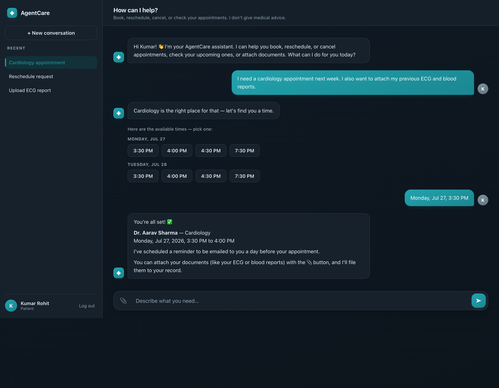
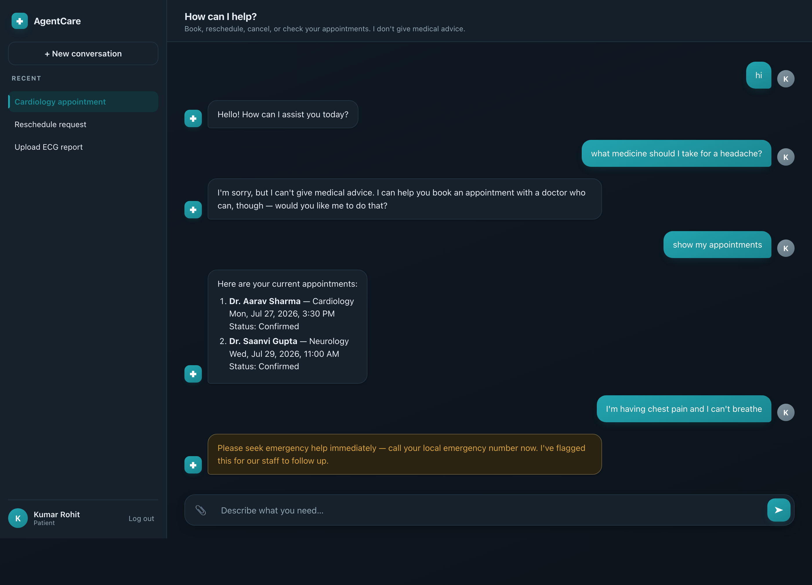
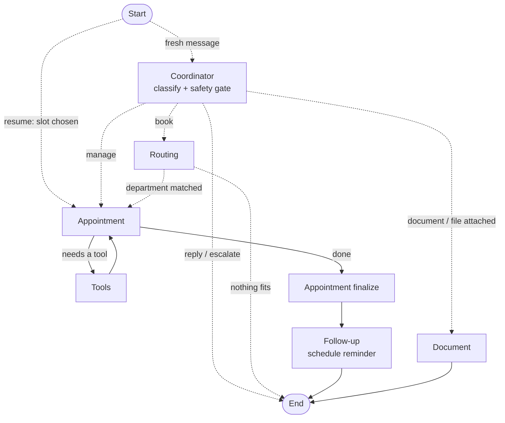

# AgentCare

AgentCare is an agentic AI assistant for hospital **administrative** workflows: greeting and identifying patients, routing requests to the right department, checking doctor availability, booking / rescheduling / cancelling appointments, filing supporting documents, scheduling reminders, and escalating emergencies to a human - all through a natural, streaming chat interface.
 
## What this is *not*

AgentCare never diagnoses conditions, interprets results, prescribes medication, or recommends dosages, and it does not replace a healthcare professional. Its scope is strictly administrative. A request for clinical judgment is **politely declined**, and a genuine emergency is **escalated to a human** - neither is ever handled autonomously.

## Highlights

- **Single-call Coordinator that is also the safety gate** - one LLM decision per message: escalate an emergency, decline medical advice / reply conversationally, or route a real task to a specialist.
- **Specialist agents** for department routing, appointments (a ReAct tool-loop with a human-in-the-loop slot picker), documents, and follow-up reminders.
- **Human-in-the-loop** slot selection via LangGraph `interrupt()` / resume.
- **Durable, resumable state** - every conversation is a LangGraph thread persisted to Postgres, so a paused booking survives a page reload.
- **Short-term memory** - the recent transcript is fed back into the agents so follow-ups like *"cancel the second one"* or *"what's the doctor's name?"* resolve in context.
- **Vanilla JS chat UI** - streaming (typewriter) replies, markdown, conversation history, and document upload (📎).
- **Full audit trail** - every classification, booking, escalation, and document write is logged.

## Screenshots

Booking a cardiology appointment - the Coordinator routes to Cardiology, the patient picks a slot from the human-in-the-loop picker, and gets a confirmation (with the multi-intent nudge to attach documents):



Conversational safety in one thread - a greeting, a politely declined medical-advice question, an appointments list, and a genuine emergency being escalated:



## Architecture

Five distinct agent roles, orchestrated as one compiled LangGraph `StateGraph` ([`app/agents/graph.py`](app/agents/graph.py)):

| Agent | Responsibility |
|---|---|
| **Coordinator** | The single front door **and** safety gate. In one LLM call it decides: `escalate` (emergency), `reply` (chit-chat or a medical-advice decline), or route a task (`book` / `manage` / `document`). Resets per-turn state and creates/updates the `workflow_run`. |
| **Department Routing** | Maps a new booking (or a described symptom) to a real department; escalates only when nothing fits. |
| **Appointment** | A ReAct tool-loop: lists open slots, pauses for the patient to pick one, then books / reschedules / cancels and confirms from the persisted record. |
| **Document** | Files an uploaded document (classifies its type, stores metadata) and lists a patient's documents on request. |
| **Follow-up** | Schedules an email reminder ~24h before an appointment. |

**Stack:** Python · FastAPI · LangGraph · OpenAI (via LangChain) · Supabase (Postgres + Auth + Storage) · vanilla HTML/CSS/JS.

### Workflow graph

The Coordinator runs on every message. Conversational replies and emergencies end the turn there; real tasks are handed to a specialist. An attached file skips classification and goes straight to the Document agent. A **resume** (the patient picked a slot) re-enters the paused Appointment loop directly rather than re-running the pipeline.


```mermaid
graph TD;
    START([Start]) -. fresh message .-> C[Coordinator<br/>classify + safety gate]
    START -. "resume: slot chosen" .-> A

    C -. "reply / escalate" .-> END([End])
    C -. "book" .-> R[Routing]
    C -. "manage" .-> A[Appointment]
    C -. "document / file attached" .-> D[Document]

    R -. department matched .-> A
    R -. nothing fits .-> END

    A -->|needs a tool| T[Tools]
    T --> A
    A -->|done| F[Appointment finalize]
    F --> FU[Follow-up<br/>schedule reminder]
    FU --> END

    D --> END
```

## Data model

All tables live in [`supabase/migrations/`](supabase/migrations/), applied in order:

- `profiles` - one row per login identity (patient / doctor / staff-admin), 1:1 with Supabase `auth.users`
- `patient_profiles` / `staff_profiles` - role-specific detail
- `departments`, `doctors` - hospital structure
- `appointment_slots`, `appointments` - scheduling
- `patient_documents` - uploaded-document metadata (files live in a private Storage bucket)
- `workflow_runs` - persisted state per conversation
- `chat_messages` - the clean conversation transcript (history view + short-term memory)
- `reminders`, `escalations`, `audit_events` - follow-ups, human review, and the audit trail

**Auth model:** patients self-register (a trigger hard-codes their role to `patient`); doctor/staff/admin accounts are provisioned only by an existing admin. The backend uses the service-role key; the browser only ever holds the publishable key (for Auth).

## Project structure

```
app/
  main.py                FastAPI app: routers + static frontend
  agents/                one file per agent + the LangGraph graph + shared state
  services/              business logic (documents, appointments, workflow, llm, supabase)
  repositories/          thin data-access layer over Supabase
  tools/                 agent-callable tools (audit, reminders, escalations, …)
  api/routes/            FastAPI route handlers (chat, patient, staff, health)
  schemas/               Pydantic request/response + agent output models
config.py                environment-based settings
auth.py                  JWT verification + role lookup (RBAC)
frontend/                vanilla HTML/CSS/JS chat UI
supabase/migrations/     schema, in applied order
tests/                   pytest suite (API + agent behaviour)
docs/                    design notes (e.g. the /chat flow)
```

## Setup

### Prerequisites
- Python 3.12 · [uv](https://docs.astral.sh/uv/) · Docker · [Supabase CLI](https://supabase.com/docs/guides/cli)

### 1. Install
```bash
uv sync
```

### 2. Configure
```bash
cp .env.example .env    # then fill in the values
```
Supabase values come from `supabase status` (local) or your project settings. Also set `OPENAI_API_KEY` and the `DATABASE_URL` session-pooler string.

### 3. Database
```bash
supabase start
supabase db reset       # applies every migration + seed data
```

### 4. Run
```bash
uv run uvicorn app.main:app --reload
```
Open **http://localhost:8000** - the chat UI is served by the same app. (The frontend's Supabase URL/publishable key are set at the top of [`frontend/app.js`](frontend/app.js).)

## Testing

```bash
uv run pytest              # everything
uv run pytest -m "not llm" # fast: API validation + access-control only
uv run pytest -m llm       # agent-behaviour tests (real OpenAI calls)
```

- **API / access-control** tests use FastAPI's `TestClient` with auth stubbed, and assert validation, auth guards, and IDOR protection (a patient can't read/delete another's conversation or documents).
- **Agent-behaviour** tests assert the Coordinator classifies correctly across bookings, management, documents, greetings, medical-advice declines, emergencies, and context-dependent follow-ups.

## License

MIT - see [LICENSE](LICENSE).
